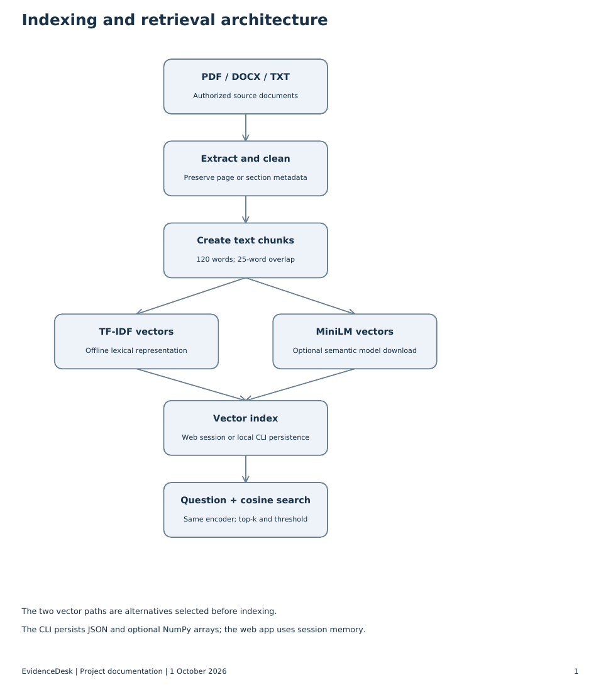
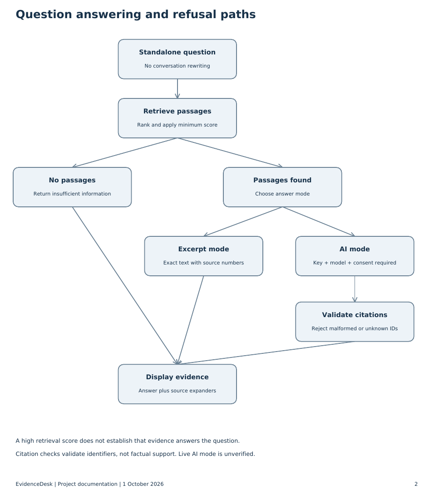
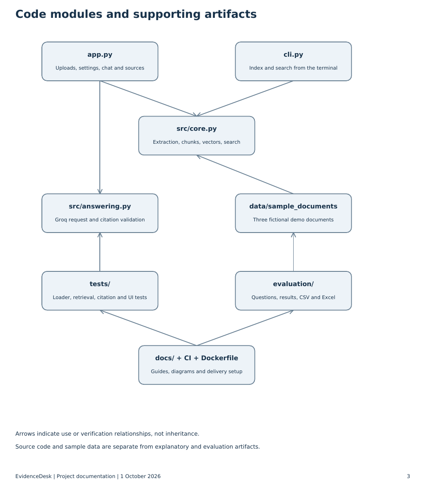

# Complete workflow and code explanation

This is a personal portfolio prototype with a tested lexical baseline, optional semantic search and optional Groq answer generation. Start with the root README. The two PDFs provide a printable guide and architecture diagrams.

## 1. Define the problem

A user has documents and needs an answer with evidence. The application must preserve document locations, retrieve relevant passages and let the user inspect those passages. Its scope is standalone questions over PDF, DOCX and UTF-8 TXT. It does not train a new language model, perform OCR, or remember previous questions when retrieving.

## 2. Collect and load documents

The sample corpus is fictional. Use only authorized documents for your own experiments. In `app.py`, uploads provide a filename and bytes. `chunk_document()` calls `extract()` in `src/core.py`. PDF extraction records a page for every text segment. DOCX extraction records paragraph and table numbers. TXT uses blank-line-separated sections. Empty text is rejected; format and size limits protect the prototype from some accidental misuse.

PDF layout, scanned pages and complex tables can reduce extraction quality. Always inspect representative extracted text before interpreting retrieval results. The current DOCX loader extracts paragraphs and tables separately rather than preserving their interleaved document order.

## 3. Clean and split

The cleaner collapses repeated horizontal whitespace and drops empty sections. Chunking uses windows of 120 words with 25 words of overlap. A 301-word section yields starts at offsets 0, 95 and 190; the last chunk retains the tail. Chunks do not cross source-section boundaries. Overlap reduces lost context but increases duplication.

The chunk ID hashes the filename, document content hash, location and window start. Each `Chunk` retains `id`, `source`, `location` and `text`. Exact repeated uploads can be deduplicated by ID. Changed documents produce new IDs. A rebuild replaces the web knowledge base, rather than incrementally merging old and new versions.

## 4. Create vectors

The lexical backend fits scikit-learn `TfidfVectorizer` on the chunk texts. It uses words and two-word phrases, English stopword filtering and sublinear term frequency. The fitted vocabulary must also transform the question. A question containing only unknown words may have no useful vector match.

The optional semantic backend uses `sentence-transformers/all-MiniLM-L6-v2`. Both passages and questions are encoded with the same model and normalized. Dense vectors can match paraphrases, but may retrieve passages that are related without actually answering the question. The model needs installation and an initial download; this branch has not been verified with a live model in the delivered build.

## 5. Store the index

`Index` owns chunks, the selected encoder and vector representation. The Streamlit application stores the object in the current user's server session. The CLI writes `index.json`; semantic mode also writes `vectors.npy`. No pickle is read. Loading the lexical index refits its vectorizer on stored text. Loading the semantic index restores arrays and loads the matching query model. Local index files contain document text and should not be published.

## 6. Retrieve passages

`Index.search(question, k, threshold)` represents the question, computes cosine similarity and returns the highest scoring passages above the minimum score. The UI defaults to 3 passages; the core/CLI defaults to 4. The evaluation uses 3. The starting thresholds are 0.12 for lexical and 0.35 for semantic search. These values are not calibrated probabilities or guarantees.

The returned list contains `(Chunk, score)` pairs. An empty list produces the insufficient-information response. A nonempty list can still contain insufficient evidence, which is why retrieval and answerability must be evaluated separately.

## 7. Answer and cite

In excerpt mode, `evidence_answer()` displays the full retrieved text with [1], [2] and similar markers. This is useful evidence retrieval, not generative AI. The UI labels it accordingly.

In optional AI mode, `generate()` in `src/answering.py` sends the question and numbered passages to Groq. The system instruction treats documents as untrusted evidence, requests evidence-only answers and asks for JSON containing an answer and citation list. A 45-second timeout and readable error messages handle connection/provider problems. The user must enable AI mode and consent to sending excerpts to the provider.

`validate()` parses JSON and checks field types, citation ranges and consistency between inline citation numbers and the citation list. These are structural checks. A valid ID does not establish that a claim is supported; no automatic claim-verification model is included.

## 8. Display and interact

`app.py` builds the index only when the user clicks the build button. It shows document/chunk counts, an input for standalone questions, answer messages, elapsed time and source expanders. A rebuild clears displayed history; clearing the session removes both history and the active index. Changing the retrieval setting requires rebuilding before it becomes active. Follow-up references such as “what about that?” are not automatically resolved.

## 9. Evaluate

The 30-question development fixture has 25 answerable and 5 unsupported questions. Evidence hit rate checks whether the expected source and evidence phrase appear in the top three retrieved chunks. The recorded run found evidence for 23/25 positives and returned no passages for 3/5 negatives. It missed the password-length and cancellation questions and retrieved passages for unsupported overtime and intern-parental-leave questions.

The Excel workbook imports that recorded run. It uses formulas to calculate counts and rates from the question detail sheet. It does not rerun retrieval, automatically refresh JSON, or measure LLM answer quality. Editing imported outcomes changes its summary; to add new records, extend both the table and bounded summary formulas. The CSV is a portable export of all recorded rows.

The 16 automated tests cover real loader behavior, chunk overlap/tails, duplicate removal, retrieval, persistence, invalid citations, no-network abstention and Streamlit's sample chat flow. A small fixture and passing tests do not prove production readiness.

## 10. Publish, deploy and maintain

GitHub contains application source, sample documents, evaluation artifacts, documentation, a Docker recipe and an Actions test workflow. GitHub publication is separate from an actual hosted application. Run locally first. Live semantic inference, provider calls and Docker execution need their own verification in the target environment. Private multi-user hosting additionally needs authentication, operational limits and appropriate data handling.

To improve the project, build a separate held-out question set, compare retrieval modes at a fixed top-k, then test hybrid retrieval and reranking. Measure citation support, answer correctness, appropriate refusal, full-request latency and real API cost. Keep reported results tied to the exact code, model and dataset version.

## Diagrams

Each diagram is also available as editable Mermaid source (`.mmd`) and vector SVG. The PDF `Workflow_and_Structure_Diagrams.pdf` contains all three diagrams.
